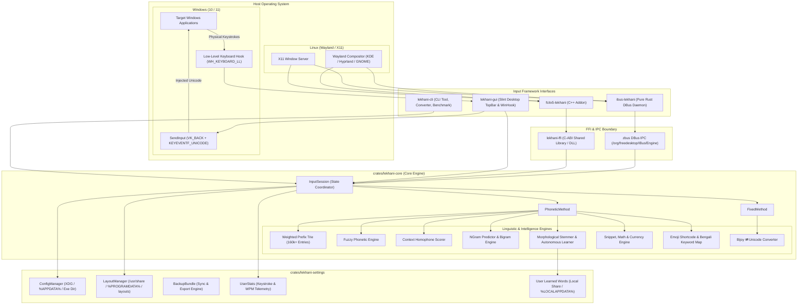
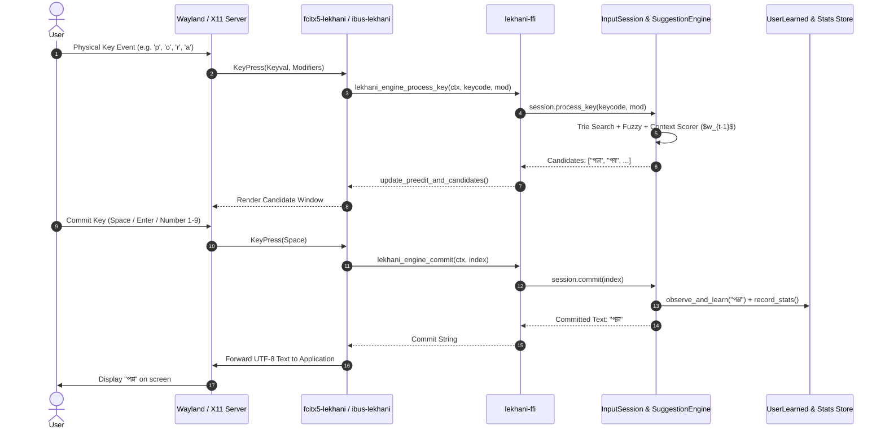

# 🏛️ Lekhani (লেখনী) - Architecture & Features Specification

> **Version:** 3.0.0  
> **Status:** Production / Stable  
> **Language:** 100% Pure Rust (C++ C-ABI bridge for native Fcitx5 plugin)  
> **License:** GPL-3.0-or-later  

Lekhani (লেখনী) is a modern, ultra-fast, memory-safe, and offline-first Bengali input method engine and desktop suite engineered for Linux (KDE Plasma 6, GNOME, Wayland, and X11) and Windows (10 and 11).

---

## 📑 Table of Contents

1. [Architectural Overview & Design Principles](#1-architectural-overview--design-principles)
2. [System Architecture Diagram](#2-system-architecture-diagram)
3. [Crate Ecosystem & Workspace Structure](#3-crate-ecosystem--workspace-structure)
4. [Linguistic & Core Intelligence Subsystems](#4-linguistic--core-intelligence-subsystems)
   - [4.1 Weighted Prefix Trie & Dictionary Engine](#41-weighted-prefix-trie--dictionary-engine)
   - [4.2 Fuzzy Phonetic Matching Engine](#42-fuzzy-phonetic-matching-engine)
   - [4.3 Context-Aware Homophone Disambiguation](#43-context-aware-homophone-disambiguation)
   - [4.4 Zero-Preedit Next-Word Prediction](#44-zero-preedit-next-word-prediction)
   - [4.5 Autonomous Morphological Stemmer & Unsupervised Learner](#45-autonomous-morphological-stemmer--unsupervised-learner)
   - [4.6 Bilingual Code-Mixing & Tech Loanwords](#46-bilingual-code-mixing--tech-loanwords)
   - [4.7 Dynamic Morphological Sandhi Engine](#47-dynamic-morphological-sandhi-engine)
5. [Productivity & Power-User Tools](#5-productivity--power-user-tools)
   - [5.1 Smart Typography & Punctuation](#51-smart-typography--punctuation)
   - [5.2 Inline Math Calculator & Unit/Currency Converter](#52-inline-math-calculator--unitcurrency-converter)
   - [5.3 Semantic Emojis, Bengali Shortcodes & Custom Macros](#53-semantic-emojis-bengali-shortcodes--custom-macros)
   - [5.4 Bidirectional Bijoy (ANSI) ⇄ Unicode Converter](#54-bidirectional-bijoy-ansi--unicode-converter)
6. [Fixed Layout Engine & Typing Automations](#6-fixed-layout-engine--typing-automations)
7. [Desktop GUI Suite (Slint) & System Tray](#7-desktop-gui-suite-slint--system-tray)
8. [Windows Native Input Subsystem & Global Hook](#8-windows-native-input-subsystem--global-hook)
9. [CLI, Data Backup, Sync & Telemetry](#9-cli-data-backup-sync--telemetry)
10. [Lifecycle of a Keystroke (Data Flow)](#10-lifecycle-of-a-keystroke-data-flow)

---

## 1. Architectural Overview & Design Principles

Lekhani is designed around four core engineering pillars:

- **⚡ Sub-Millisecond Latency (< 0.05 ms):** All dictionary prefix searches, transliterations, and context ranking operations execute in microseconds using flat binary memory structures, hash tables, and pre-compiled Trie nodes without allocating on the hot keystroke path.
- **🛡️ 100% Memory Safety & Robustness:** Implemented entirely in safe Rust, eliminating buffer overflows, memory leaks, and segmentation faults common in legacy C/C++ input methods.
- **🔒 Zero Telemetry & 100% Offline Privacy:** All machine intelligence, n-gram predictions, morphological learning, and dictionary lookups run locally on the user's CPU without making any network requests.
- **🌐 Universal Cross-Platform Compatibility:** Native first-class support for both Linux (**Fcitx5** for Wayland/KDE and **IBus** for GNOME/Ubuntu) and Windows (**Low-Level Keyboard Hook** `WH_KEYBOARD_LL` + `SendInput` and `Shell_NotifyIconW` system tray).

---

## 2. System Architecture Diagram



---

## 3. Crate Ecosystem & Workspace Structure

The project is structured as a modular Cargo workspace:

```
lekhani/
├── crates/
│   ├── lekhani-core/         # Core phonetic & fixed engines, trie, fuzzy matcher, morphology
│   ├── lekhani-settings/     # XDG config, backup bundle, layout discovery, user stats
│   ├── lekhani-ffi/          # C-compatible FFI layer for Fcitx5 and native integrations
│   ├── lekhani-fcitx5/       # Native C++ Fcitx5 shared library plugin (fcitx5-lekhani.so)
│   ├── lekhani-ibus/         # Standalone pure-Rust IBus DBus service daemon
│   ├── lekhani-gui/          # Slint desktop GUI (TopBar, layout viewer, autocorrect manager)
│   └── lekhani-cli/          # Command-line utility, converter, backup sync, typing dashboard
├── data/
│   ├── dictionaries/         # Flat binary dictionary and root unigrams
│   ├── layouts/              # Avro Phonetic, Probhat, Jatiya, Munir, Borno, Easy
│   └── icons/                # Vector SVG and HiDPI PNG application icons
├── packaging/                # Arch PKGBUILD, Fedora RPM spec, Debian debian/ rules
└── install.sh                # Interactive automated installer script
```

---

## 4. Linguistic & Core Intelligence Subsystems

### 4.1 Weighted Prefix Trie & Dictionary Engine
- Located in `crates/lekhani-core/src/trie.rs` and `src/phonetic/database.rs`.
- Contains **160,000+ words** indexed in a memory-compact prefix trie.
- Every node stores `(Word, Frequency)`. Candidate sorting is scored dynamically:
  $$\text{Score} = \text{Frequency} \times \frac{1}{1 + |\text{QueryLen} - \text{WordLen}|}$$
- Over **200+ high-frequency Bengali unigram roots** (pronouns, common verbs, everyday nouns) are injected with elevated base weights, guaranteeing that common conversational words rank #1 over obscure alphabetical entries.

### 4.2 Fuzzy Phonetic Matching Engine
- Located in `crates/lekhani-core/src/phonetic/fuzzy.rs`.
- Automatically forgives Latin spelling variations and sound ambiguities:
  - **Sibilants:** `s` ⇄ `sh` ⇄ `ss` (`শ` / `ষ` / `স`)
  - **Palatals:** `z` ⇄ `j` (`জ` / `য`)
  - **Vowels:** `i` ⇄ `ee` ⇄ `ii` (`ই` / `ঈ`), `u` ⇄ `oo` ⇄ `uu` (`উ` / `ঊ`)
  - **Nasals:** `n` ⇄ `N` (`ন` / `ণ`)
  - **Flaps/Rhothics:** `r` ⇄ `rr` ⇄ `rrh` (`র` / `ড়` / `ঢ়`)

### 4.3 Context-Aware Homophone Disambiguation
- Located in `crates/lekhani-core/src/phonetic/suggestion.rs`.
- Evaluates the preceding committed word $w_{t-1}$ to resolve homophones and orthographic ambiguities:
  - Preceding $w_{t-1} \in \{\text{বই, পত্রিকা, লেখা, ক্লাস, পরীক্ষা}\} \implies$ `pora` ➔ **`পড়া`** (Reading)
  - Preceding $w_{t-1} \in \{\text{শার্ট, প্যান্ট, জামা, কাপড়, জুতো, ঘড়ি}\} \implies$ `pora` ➔ **`পরা`** (Wearing)
  - Preceding $w_{t-1} \in \{\text{বাংলা, ইংরেজি, মাতৃভাষা, আন্তর্জাতিক}\} \implies$ `bhasha` ➔ **`ভাষা`** (Language)
  - Preceding $w_{t-1} \in \{\text{পানিতে, জলে, নদীতে, সাগরে, ভেসে}\} \implies$ `bhasa` ➔ **`ভাসা`** (Floating)
  - Preceding $w_{t-1} \in \{\text{জীবনের, মূল, প্রধান, উদ্দেশ্য}\} \implies$ `lokkho` ➔ **`লক্ষ্য`** (Goal/Aim)
  - Preceding $w_{t-1} \in \{\text{এক, দুই, পাঁচ, দশ, টাকা, মানুষ}\} \implies$ `lokkho` ➔ **`লক্ষ`** (Hundred Thousand)

### 4.4 Zero-Preedit Next-Word Prediction
- Located in `crates/lekhani-core/src/phonetic/suggestion.rs` and `src/ngram.rs`.
- When preedit buffer is idle immediately following a word commit, the suggestion panel streams top probable successor words:
  - `আমি` ➔ `["ভালো", "তোমাকে", "যাব", "করব", "চাই", "আছি", "এখন", "বলছি"]`
  - `তুমি` ➔ `["কেমন", "কোথায়", "কী", "কবে", "যাবে", "খাবে", "আছো", "বলো"]`
  - `ধন্যবাদ` ➔ `["ভাই", "আপনাকে", "তোমাকে", "অনেক", "স্যার", "জানাই"]`
  - `শুভ` ➔ `["সকাল", "রাত্রি", "সন্ধ্যা", "কামনা", "নববর্ষ", "জন্মদিন"]`

### 4.5 Autonomous Morphological Stemmer & Unsupervised Learner
- Located in `crates/lekhani-core/src/phonetic/morphology.rs` and `src/phonetic/learner.rs`.
- **Morphological Stemmer:** Decomposes inflected Bengali tokens and extracts base stems:
  - `কুয়েটে` ➔ `কুয়েট` (Stem) + `-ে` (Suffix)
  - `কম্পিউটারগুলো` ➔ `কম্পিউটার` (Stem) + `-গুলো` (Suffix)
  - `শিক্ষার্থীদের` ➔ `শিক্ষার্থী` (Stem) + `-দের` (Suffix)
  - `বইটির` ➔ `বই` (Stem) + `-টির` (Suffix)
- **Autonomous Learner:** Detects unrecognized committed words and stems, indexing them into the live runtime Trie and persisting to `~/.local/share/lekhani/user_learned.json`.

### 4.6 Bilingual Code-Mixing & Tech Loanwords
- Built-in recognition for modern English loanwords:
  - `meeting` ➔ `মিটিং`, `meeting`
  - `laptop` ➔ `ল্যাপটপ`, `laptop`
  - `password` ➔ `পাসওয়ার্ড`, `password`
  - `doctor` ➔ `ডাক্তার`, `doctor`
  - `phone` ➔ `ফোন`, `phone`

### 4.7 Dynamic Morphological Sandhi Engine
- Resolves Bengali phonological mutations during suffix attachment:
  - **Antastha-Ya Glide Insertion:** When a vowel-ending root joins a vowel kar suffix (e.g. `খাওয়া` + `র` ➔ `খাওয়ার`).
  - **Khanda-Ta Assimilation:** `ৎ` transforms to `ত` before vowel kars (e.g. `উৎসব` ➔ `উৎসবে`).
  - **Anusvara Mutation:** `ং` transforms to `ঙ` (e.g. `সংস্থা` ➔ `সংগঠন`).

---

## 5. Productivity & Power-User Tools

### 5.1 Smart Typography & Punctuation
- `..` ➔ **`।`** (Bengali Dari)
- `--` ➔ **`—`** (Em-dash)
- `...` ➔ **`…`** (Ellipsis)
- `* ` ➔ **`• `** (Bullet list item)

### 5.2 Inline Math Calculator & Unit/Currency Converter
- **Math Formulas:** Typing `=125*8` ➔ outputs `১,০০০` and `1000`
- **Functions:** `=sqrt(144)` ➔ outputs `১২`
- **Currency Conversion:** `#usd50` ➔ outputs `৳৬,১০০` (live dynamic conversion)
- **Bengali Digits:** Automatically formats numeric results with Bengali numerals (`০-৯`).

### 5.3 Semantic Emojis, Bengali Shortcodes & Custom Macros
- **Bengali Concept Keywords:**
  - `:bhalobasha:` / `bhalobasha` ➔ ❤️
  - `:cha:` / `cha` ➔ ☕
  - `:pani:` / `pani` / `jol` ➔ 💧
  - `:vath:` / `bhat` ➔ 🍚
  - `:daktar:` / `daktar` ➔ 🩺
  - `:gari:` / `gari` ➔ 🚗
  - `*taka*` / `$$` ➔ ৳
- **Dynamic Date & Time Macros:**
  - `#tarikh` ➔ outputs current date in Bengali (e.g. `১১ সেপ্টেম্বর ২০২৬`)
  - `#shomoy` ➔ outputs current time in Bengali
  - `!shubhechha` ➔ `আন্তরিক শুভেচ্ছা ও অভিনন্দন`
- **User Custom Snippets:**
  - Custom text expansion triggers (e.g. `;email` ➔ `user@example.com`, `;addr` ➔ Address).

### 5.4 Bidirectional Bijoy (ANSI) ⇄ Unicode Converter
- Lossless conversion between legacy ANSI Bijoy (SutonnyMJ) encoded strings and standard Unicode Bengali.
- Available in CLI (`lekhani bijoy-to-unicode` / `lekhani unicode-to-bijoy`) and inside the Slint GUI converter tab.

---

## 6. Fixed Layout Engine & Typing Automations

Lekhani includes built-in support for all standard physical Bengali keyboard layouts:
- **Probhat (প্রভাত)**
- **National / Jatiya (জাতীয়)**
- **Munir Optima (মুনীর অপটিমা)**
- **Borno (বর্ণ)**
- **Avro Easy (সহজ)**

### Fixed Layout Automations:
- **Auto Vowel Forming:** Automatically transforms root vowel + kar into compound vowels (`অ` + `া` ➔ `আ`).
- **Auto Chandra Position:** Re-orders Chandra-bindu typed before vowels (`কঁ` + `া` ➔ `কাঁ`).
- **Traditional Kar Joining:** Prevents unwanted automatic ligatures using zero-width non-joiners (ZWNJ).
- **Old-Style Reph (র্):** Handles legacy typing sequence where Reph is typed before consonant.
- **Numberpad Bengali Digits:** Automatically maps hardware keypad numbers to Bengali digits (`০-৯`).

---

## 7. Desktop GUI Suite (Slint) & System Tray

Built using the hardware-accelerated **Slint** UI framework:
- **Floating TopBar (`TopBarWindow`):** Frameless, sleek, draggable top bar with quick layout switching and dark/light modes.
- **Interactive Layout Viewer:** Live on-screen keyboard viewer with key-press lighting up and AltGr (Level 3 shift) toggling.
- **AutoCorrect & Dictionary Manager:** Live search, insert, and deletion of custom user autocorrect entries.
- **Bijoy Converter Utility:** Live bidirectional text box for pasting and converting legacy documents.
- **Desktop System Tray:** Implemented with `ksni` (StatusNotifierItem DBus standard) for seamless integration with KDE Plasma, GNOME, and XFCE system trays.

---

## 8. Windows Native Input Subsystem & Global Hook

On Windows 10 & 11, Lekhani provides a native typing engine inspired by the classic Avro Keyboard system-hook architecture:

- **Global Low-Level Keyboard Hook (`WH_KEYBOARD_LL`):**
  - Intercepts physical keystrokes system-wide before they reach the focused target application.
  - Checks `KBDLLHOOKSTRUCT.flags & 0x10` (`LLKHF_INJECTED`) to safely filter synthetic events and avoid recursive re-hook loops.
  - Global <kbd>F12</kbd> hotkey provides instant toggling between English and Bengali typing modes.
- **Smart Preedit Buffer & Dynamic Unicode Injection (`SendInput`):**
  - As the user types Latin phonetic letters, the engine buffers keycodes in `InputSession`.
  - Upon candidate change: calculates the previous uncommitted UTF-16 code unit count, emits simulated backspaces (`VK_BACK`), and injects the new candidate via `SendInput` with `KEYEVENTF_UNICODE`.
  - Commits on <kbd>Space</kbd>, <kbd>Enter</kbd>, or punctuation and seamlessly passes through native shortcuts (<kbd>Ctrl+C</kbd>, <kbd>Alt+Tab</kbd>, etc.).
- **Windows Taskbar System Tray (`win_tray.rs`):**
  - Registered via Win32 `Shell_NotifyIconW`.
  - Provides a dynamic tooltip reflecting current mode (`Lekhani [বাংলা - Avro Phonetic]`).
  - Right-click context menu enables quick mode toggling, settings access, and application exit.
- **Console UTF-8 Initialization:**
  - Automatic `SetConsoleOutputCP(CP_UTF8)` configuration ensuring Bengali glyphs render cleanly in PowerShell and Windows Terminal.

---

## 9. CLI, Data Backup, Sync & Telemetry

Lekhani provides a comprehensive command-line interface (`lekhani`):

```bash
# Transliterate or test input
lekhani test "ami banglay gaan gai"

# View personal typing dashboard
lekhani stats

# Manage custom user dictionary & macros
lekhani dict add ";mail" "user@example.com"
lekhani dict list
lekhani dict remove ";mail"

# Export / Import complete user configuration, dictionary, and layouts
lekhani sync --export ./lekhani_backup.json
lekhani sync --import ./lekhani_backup.json

# Convert legacy Bijoy text
lekhani bijoy-to-unicode "Avgvi †mvbvi evsjv"
lekhani unicode-to-bijoy "আমার সোনার বাংলা"

# Benchmark engine throughput
lekhani benchmark
```

---

## 10. Lifecycle of a Keystroke (Data Flow)


